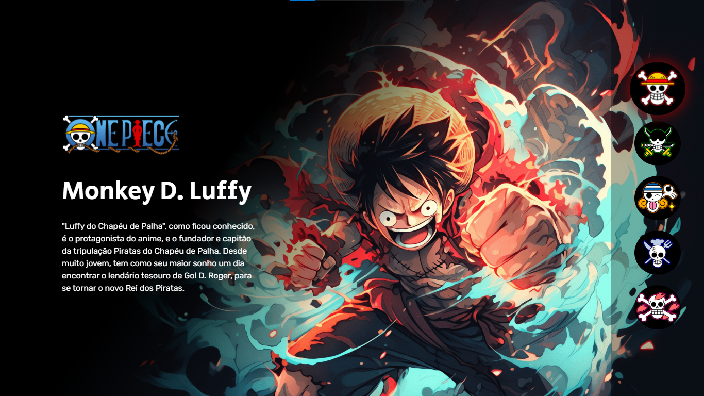

<h1 align="center"> Projeto One Piece 🏴‍☠️👒 </h1>

Evento online exclusivo e gratuito, promovido pela devemdobro para ensino de tecnologias WEB.

  <a href="#-tecnologias">Tecnologias</a>&nbsp;&nbsp;&nbsp;|&nbsp;&nbsp;&nbsp;
  <a href="#-projeto">Projeto</a>&nbsp;&nbsp;&nbsp;|&nbsp;&nbsp;&nbsp;
  <a href="#-layout">Layout</a>&nbsp;&nbsp;&nbsp;|&nbsp;&nbsp;&nbsp;
  <a href="#memo-licença">Licença</a>

  

 

  

## 🚀 Tecnologias

Esse projeto foi desenvolvido com as seguintes tecnologias:

- HTML e CSS
- JavaScript
- Node.js
- Git e Github

## 💻 Projeto

É um projeto que visa mostrar informações do anime "One Piece", realizando interações de botões para a troca das informações da page.

- [Acesse o projeto finalizado, online](https://disckevin.github.io/Projeto-One-Piece/)

## 🔖 Layout

O projeto foi realizando durante lives, que foram transmitidas pelo [devemdobro](https://www.instagram.com/devemdobro/).

---

Feito com ♥ by devemdobro :wave: [Visite o insta](https://www.instagram.com/devemdobro/)
